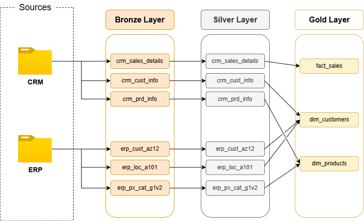
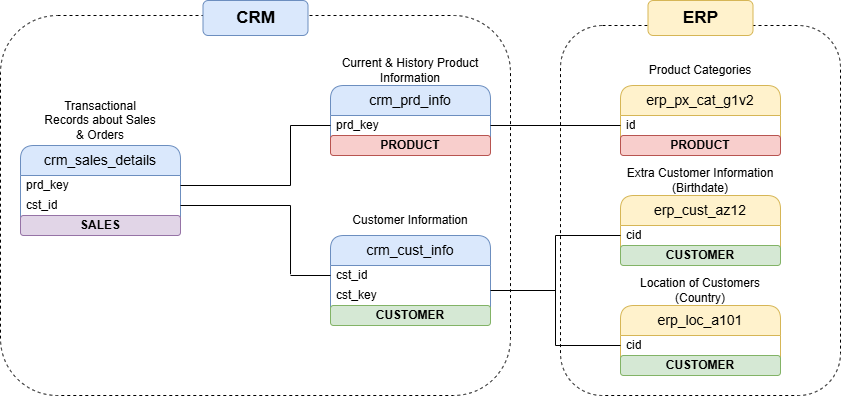
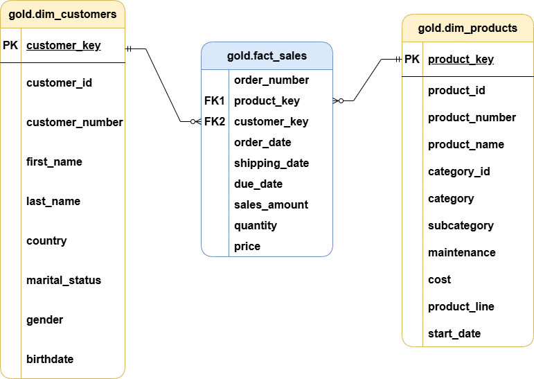

# SQL Data Warehouse Project

A modern SQL Server data warehouse built with a **medallion architecture** approach.  
The project ingests raw CSV sources into a **Bronze** layer, transforms and cleans them in **Silver**, and publishes analytics-ready models in **Gold** for reporting and analysis.



---

## 📌 Project Overview
This project demonstrates how to design and build a small but realistic data warehouse end to end:
- **Bronze** = raw landing tables loaded directly from source CSV files
- **Silver** = cleaned, standardized, and conformed tables
- **Gold** = business-ready dimensional model with star-schema style views

It also includes a data catalog, validation queries, and diagrams that document the warehouse design.

---

## 🏗️ Architecture

### Bronze Layer
The Bronze layer stores the raw source data with minimal transformation.
It is populated by the stored procedure `bronze.load_bronze`, 
which truncates the target tables and reloads them from the CSV files in `datasets/source_crm` and `datasets/source_erp`.

### Silver Layer
The Silver layer contains cleaned and standardized tables.
This is where data types are normalized, naming is harmonized, and source system inconsistencies are handled.

### Gold Layer
The Gold layer exposes business-ready views:

- `gold.dim_customers`
- `gold.dim_products`
- `gold.fact_sales`





---

## 📂 Project Structure

```text
sql-data-warehouse-project/
├── datasets/
│   ├── source_crm/  # Raw CRM CSV files
│   └── source_erp/  # Raw ERP CSV files
├── docs/
│   ├── Gold_Layer_Star_Schema.png
│   ├── Medallion_Architecture_Overview.png
│   ├── Source_Data_ERD.png
│   └── data_catalog.md
├── scripts/
│   ├── init_database.sql
│   ├── bronze/
│   │   ├── ddl_bronze.SQL
│   │   └── proc_load_bronze.sql
│   ├── silver/
│   │   ├── ddl_silver.sql
│   │   └── proc_load_silver.sql
│   └── gold/
│       └── ddl_gold.sql
└── tests/
    ├── quality_checks_gold.sql
    └── quality_checks_silver.sql
```

---

## 💎 Data model

### Source Layer
The repository includes two source systems:
- **CRM** data
- **ERP** data

### Warehouse Layer
The warehouse is organized into medallion architecture:

- **bronze** - raw ingestion tables
- **silver** - cleansed staging tables
- **gold** - analytical views and star-schema outputs

The gold layer is documented in `docs/data_catalog.md`

---

## 🚀 Features

- SQL Server database initialization script
- Bronze ingestion with `BULK INSERT`
- Clean layered warehouse design
- Dimension and fact model in the Gold layer
- Data quality checks for Silver and Gold
- Architecture and model diagrams included in the repository

---

## ⭐ Prerequisites
- Microsoft SQL Server
- A SQL client such as SQL Server Management Studio or Azure Data Studio
- Access to the CSV files in `datasets/`
- Permission to create databases, schemas, tables, and views

---

## 🛠️ How to run

1. Run `scripts/init_database.sql` to create the `DataWarehouse` database and the `bronze`, `silver`, and `gold` schemas.
2. Run `scripts/bronze/ddl_bronze.SQL` to create the Bronze tables.
3. Run `scripts/bronze/proc_load_bronze.sql` to create the Bronze loading procedure.
4. Execute `bronze.load_bronze` to load the raw source data.
5. Run `scripts/silver/ddl_silver.sql` to create the Silver tables.
6. Run `scripts/gold/ddl_gold.sql` to create the Gold views.
7. Run the validation queries in `test/quality_checks_silver.sql` and `test/quality_checks_gold.sql`.

---

## ❗ Important note

The Bronze loading procedure uses `BULK INSERT` with file paths that are hard-coded for the original local environment.
Before running it on your machine, update the paths in `scripts/bronze/proc_load_bronze.sql` so they match your local folder location.

---

## Author

**Václav Benda**


